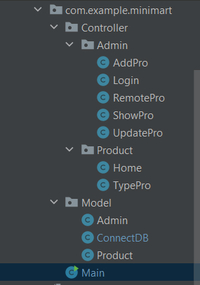
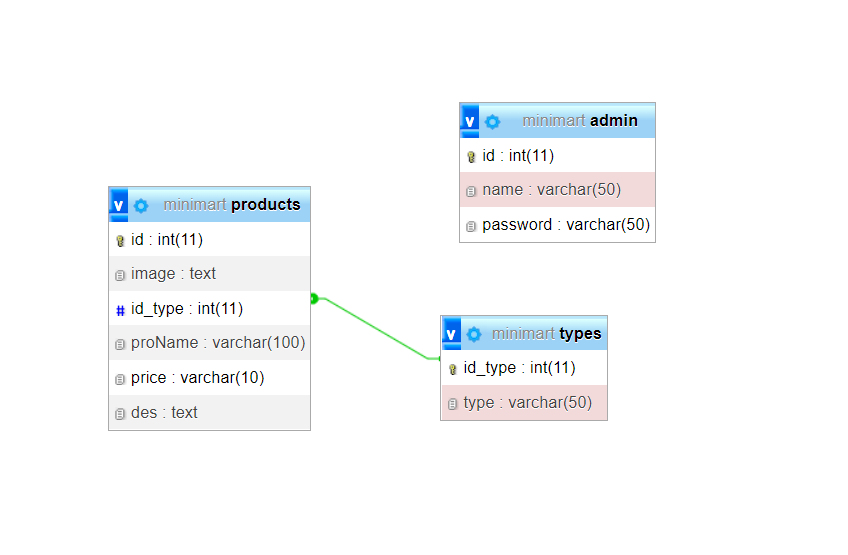

# MiniMart

## Yêu cầu
+ Ảnh chụp cấu trúc dự án (danh sách package và class):.
+ Ảnh chụp Entity Relationship Model (ERM) của database:
+ Đường link tới video demo: https://drive.google.com/drive/folders/1I6IHsH5zQ6xhymTUROPFsoOVyEyTPynJ?usp=sharing
+ Các chức năng đã làm được: Kết nối database, show, thêm, sửa, xóa.
+ Chia các class cho thêm, sửa, xóa.
+ Link sql: https://drive.google.com/drive/folders/1uUaRmHM_usO7_D1uvZUTSnaQO0v-bttU
+ Chức năng em đang làm: login admin.
+ Các chức năng dự định sẽ làm tiếp theo: Làm login user.